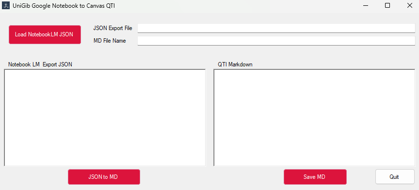

# NotebookLM to Canvas

## Overview 
This is a simple desktop application that converts the JSON output from the NotebookLM Exportkit app here: 

https://notebooklmexportkit.netlify.app/ 

Using Google NotebookLM is great for students and teachers. https://notebooklm.google.com/

It can really help with study and learning. Its quizzes are rewally cool.

I liked the idea of being able to import quizzes from the very excellent Google NotebookLM tool - but of course that doesnt work.

ExportKit app does exactly what you need - apart from the fact it does not currently support Canvas QTI import format. You also need to pay a sub but its well worth it.

So this tool converts to a Canvas friendly markdown format that can be imported as a quiz assignment.

## Importing to Canvas!

I played around with this import from other tools and converters and found the only one I could get working was this one:

https://pypi.org/project/text2qti/ 

which is a nice python app - both gui and command line.

## Workflow

So my workflow is now:

1. Do a quiz on NotebookLM 
2. Use the ExportKit to export to a JSON file
3. Use my tool here to convert that to an markdown file
4. Use the text2qti GUI tool to create a QTI zip file
5. import to Canvas and then use build to tidy it all up.
30 questions in say 10 minutes - perfect for regular assignments to check course/module source materials are being read and understood.

## Installation

I created an installer package - its in the release folder and is called publish.zip.  You should be able to download that, unzip it and then use the setup.exe - since its a .NET app. If that doesnt work you can always install Visual Studio 2026 and install and run it yourself.

## Acknowledgements

 - [NotebookLM ExportKit](https://notebooklmexportkit.netlify.app/)
 - [Text2QTI](https://github.com/gpoore/text2qti)
 

